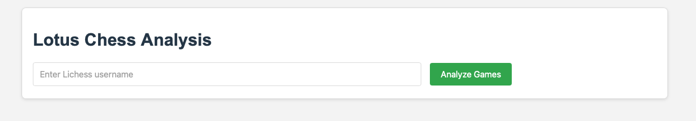

# Lotus Chess - Chess Game Analysis Service API

A high-performance API service that performs parallel analysis of chess games using Stockfish. This service analyzes the last 5 rapid/blitz games from a Lichess user's profile with optimized performance with UI for better visualization.

## Features

- **End-to-end response time under 30 seconds** via advanced parallelization
- **Caching system** to avoid reanalyzing identical positions
- **Queue system with Celery** for handling long-running analysis jobs
- **WebSocket support** for real-time progress updates
- Fetches the latest 5 rapid/blitz games from Lichess API for a given username
- Parallel analysis of chess positions using Stockfish
- Evaluates the played moves and provides top candidate moves for each position

## Technical Stack

- Python 3.9+
- FastAPI with WebSocket support
- Celery for task queue processing
- Redis for caching and task queue backend
- Socket.IO for WebSocket communications
- python-chess library
- Stockfish
- aiohttp for async HTTP calls

## Quick Start

### Using the Run Scripts (Recommended for beginners)

1. On Linux/macOS:
Please make sure that you have Redis installed first
Run this:
   ```
   
   ./start_worker.sh
   ```
   Then Run this in another terminal:
    ```
   ./start_api.sh
   ```

2. On Windows:
Please make sure that you have Redis installed first:    
Run this:
   ```
   
   ./start_worker.bat
   ```
   Then Run this in another terminal:
    ```
   ./start_api.bat
   ```

The script will:
- Create a virtual environment
- Install dependencies
- Download Stockfish automatically
- Start the application


## Usage

### Web UI to consume API

1. The server is running all you need to do is open your fav browser at http://localhost:8000 :


2. Send a POST request to analyze a user's games by typing it in the search box.

3. This script will:
    1. Fetch the user's recent games from Lichess
    2. Analyze each position with Stockfish
    3. Display the most significant moments in each game in more fancy UI.

## Configuration

You can configure the application using environment variables or a .env file:

1. Make new .env file for  the sample configuration:

2. Edit the .env file to modify settings such as:
   - API port
   - Stockfish analysis parameters
   - Lichess API configuration
   - Number of games to analyze

## API Response Format

```json
{
    "games": [
        {
            "game_id": "string",
            "time_control": "string",
            "moves": [
                {
                    "fen": "string",
                    "move_number": 1,
                    "played_move": "string",
                    "played_move_eval": 0.5,
                    "best_moves": [
                        {
                            "move": "string",
                            "eval": 0.7
                        }
                    ]
                }
            ]
        }
    ],
    "analysis_time": 12.5
}
```

## Error Handling

The service includes error handling for:

- Invalid usernames
- Lichess API unavailability
- Stockfish engine failures
- Malformed positions

## Louts Chess analysis 
You can visualize the whole flow and architecture of the project by click on <a href="architecture_diagram_viewer.html" target="_blank" rel="noopener noreferrer">architecture_diagram_viewer.html</a> and open it in your favorite browser.
