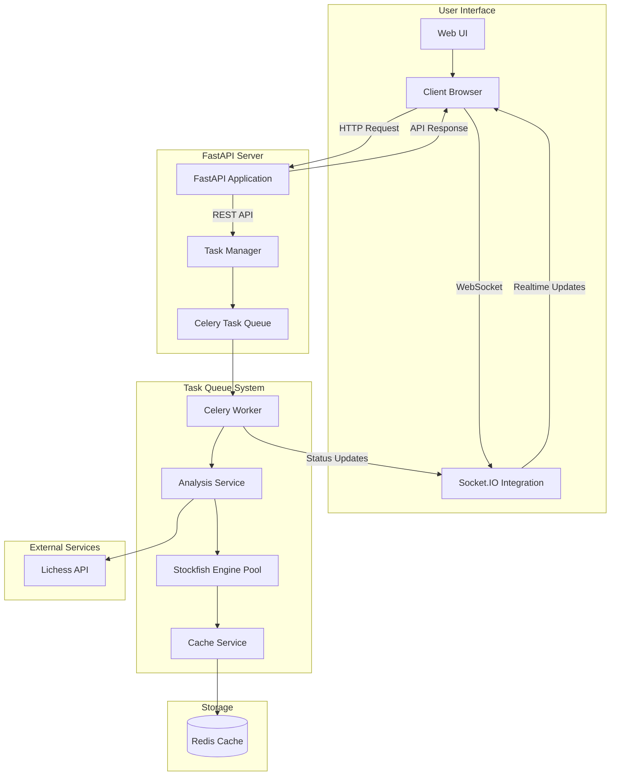
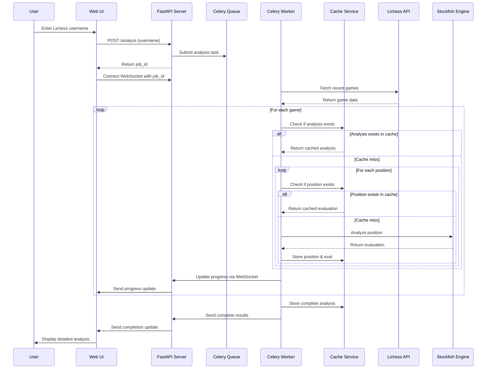
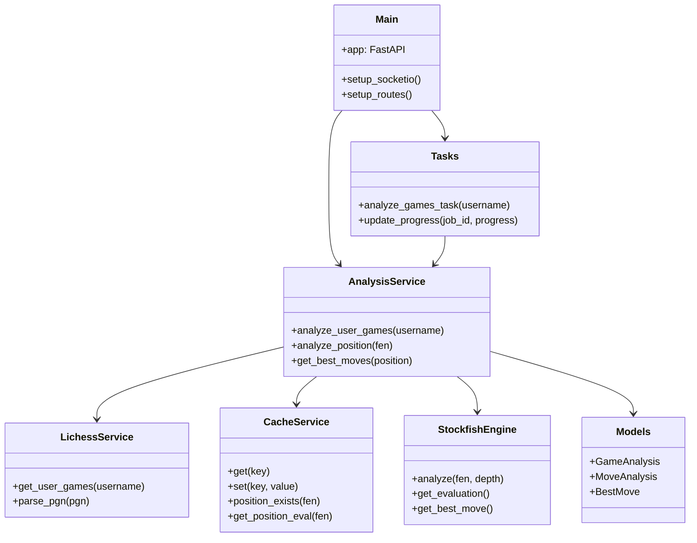

# Lotus Chess Analysis System - Architecture & Flow Control Diagram

## System Architecture Diagram

## Data Flow Diagram

## Component Structure

## Flow Control Explanation

### 1. Client Request Flow
1. User enters a Lichess username in the web UI
2. Client sends an HTTP POST request to `/analyze` endpoint
3. FastAPI server validates the request and creates a Celery task
4. Server returns a job ID to the client
5. Client establishes a WebSocket connection to receive real-time updates

### 2. Background Processing Flow
1. Celery worker picks up the analysis task
2. Worker uses LichessService to fetch the user's recent games
3. For each game:
   - Check if full game analysis exists in cache
   - If not, process each position in the game
   - For each position:
     - Check position cache
     - If position is not cached, analyze with Stockfish
     - Store position evaluation in cache
   - Send progress updates through WebSocket

### 3. Caching System Flow
1. Two-tiered caching system:
   - Redis for persistent storage of complete analyses
   - In-memory cache for position evaluations during analysis
2. Cache keys:
   - Complete analyses: `username:timestamp`
   - Positions: `fen_string`
3. Cache fallbacks:
   - If Redis is unavailable, use in-memory only
   - If position is not cached, perform full analysis

### 4. Result Delivery Flow
1. When analysis is complete, worker stores full results in Redis
2. Final results are sent to the client via WebSocket
3. UI renders the analysis with interactive chess board visualization
4. User can navigate through the games and positions

## Module Relationships

- **app/main.py**: Entry point, FastAPI setup, route definitions
- **app/tasks.py**: Celery task definitions, background processing
- **app/config.py**: System configuration, environment variables
- **app/models/analysis.py**: Data models for game analysis
- **app/services/analysis_service.py**: Core analysis business logic
- **app/services/lichess_service.py**: Integration with Lichess API
- **app/services/cache_service.py**: Caching system implementation
- **client_example.html**: Web user interface with interactive board